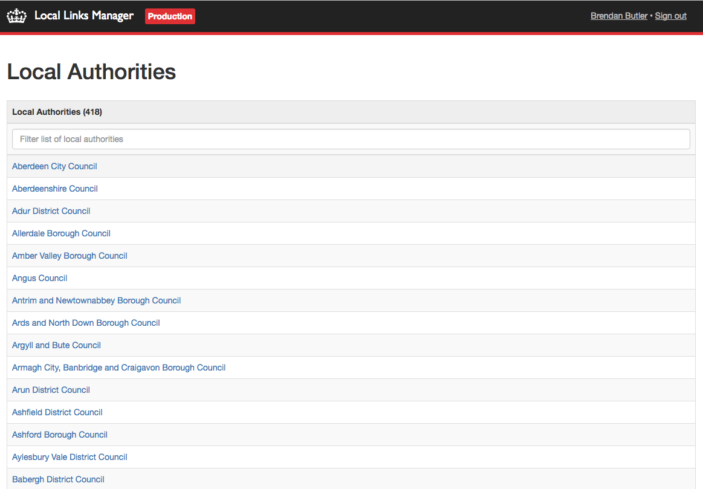
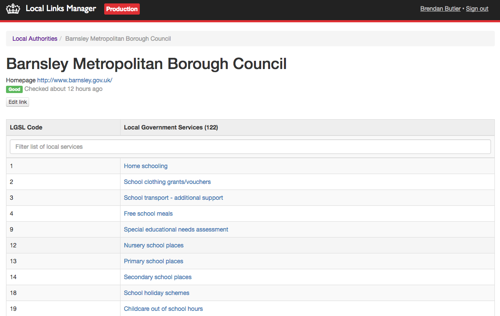
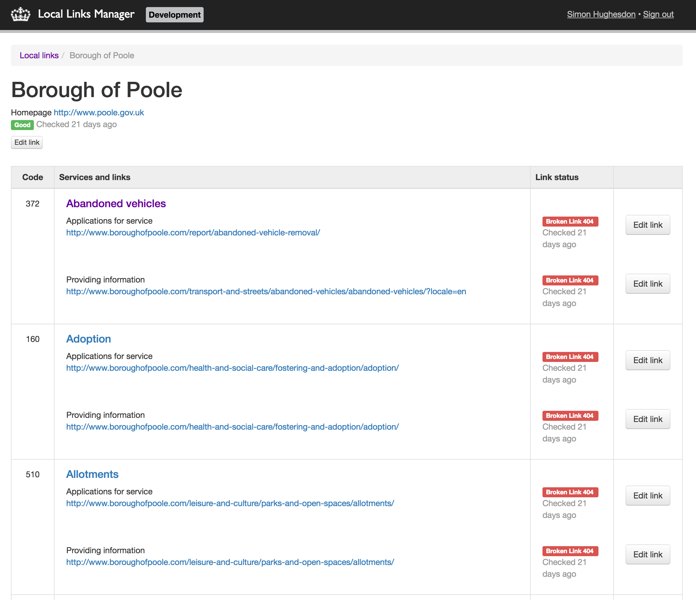
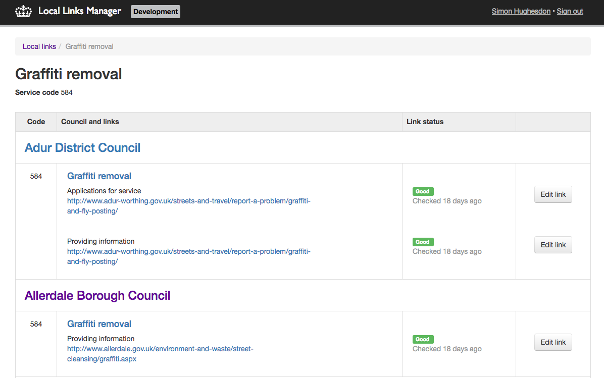

# Local-links-manager

Admin interface for managing Local Authorities links including all their services and interactions.

This app maps RESTful URLs onto a persistence layer. It doesn't face public users.

## Screenshots









## Nomenclature

- **SNAC** - Standard Names And Code - The old identifier code for locations. This is being phased out in favour of GSS codes.
- **GSS**  - Government Statistical Service - The new identifier code for locations.
- **LGSL** - Local Government Services List
- **LGIL** - Local Government Interactions List

Both LGSL and LGIL codes are used for the lookups for each Local Authority and its service interactions.

## Setup

The recommended way to run Local Links Manager is with [govuk-docker](https://github.com/alphagov/govuk-docker).

### Run with govuk-docker

- Run `make local-links-manager` inside govuk-docker
- Run `govuk-docker-run bundle exec rails db:seed` to create the default user
- Run `govuk-docker-up` to start the application. Visit at http://local-links-manager.dev.gov.uk/.
- `govuk-docker-run bundle exec rake` runs the tests.

### Run locally

You will need to have [Mapit](https://github.com/alphagov/mapit) checked out locally,
and you'll need to [import data from S3](https://github.com/alphagov/mapit/blob/master/import-db-from-s3.sh).

`bundle install`, then `./startup.sh`. `bundle exec rake` runs the tests.

Links for each local authority are available via data replication.

## Detailed documentation

- [Adding a new LGSL code](/docs/adding-a-new-lgsl-code.md)
- [Deleting a local transaction link](/docs/deleting-a-link.md)
- [Importing Local Authorities data](/docs/importing-local-authorities-data.md)
- [Exporting Local Authority links to services](/docs/exporting-local-authority-links.md)
- [Checking links](/docs/checking-links.md)

## Example API output

**Endoint for local authorities**

`GET /api/local-authority?authority_slug=<authority_slug>`

This takes parameters for Authority Slug.

Returns a JSON array containing details for the local authority and (if appropriate), the county council that contains the district.

This example is for `GET /api/local-authority?authority_slug=rochford`
```
[
  {
    "name" => 'Rochford District Council',
    "homepage_url" => "http://rochford.example.com",
    "tier" => "district"
  },
  {
    "name" => 'Essex County Council',
    "homepage_url" => "http://essex.example.com",
    "tier" => "county"
  }
]
```

This example is for `GET /api/local-authority?authority_slug=camden`
```
[
  {
    "name" => 'Camden Borough Council',
    "homepage_url" => "http://camden.example.com",
    "tier" => "unitary"
  }
]
```

We do not require authentication for this request.

**Endpoint for local transactions links**

`GET /api/link?authority_slug=<authority_slug>&lgsl=<lgsl>&lgil=<lgil>`

This takes parameters for Authority Slug, LGSL and optionally LGIL.

Returns JSON details for local authority and interaction or just local authority depending whether the LGIL parameter is passed in. If the LGIL is passed in we return the link for the LGIL if it exists. If not then only the local authority details are returned. If the LGIL is not passed in it returns the appropriate fallback link. If no appropriate link is found then once again we only return the local authority details.

```
{
  "local_authority" => {
    "name" => "Blackburn",
      "snac" => "00AG",
      "tier" => "unitary",
      "homepage_url" => "http://blackburn.example.com",
  },
    "local_interaction" => {
      "lgsl_code" => 2,
      "lgil_code" => 4,
      "url" => "http://blackburn.example.com/abandoned-shopping-trolleys/report",
    }
}
```

We do not require authentication for this request.

## Licence

[MIT License](LICENCE)
